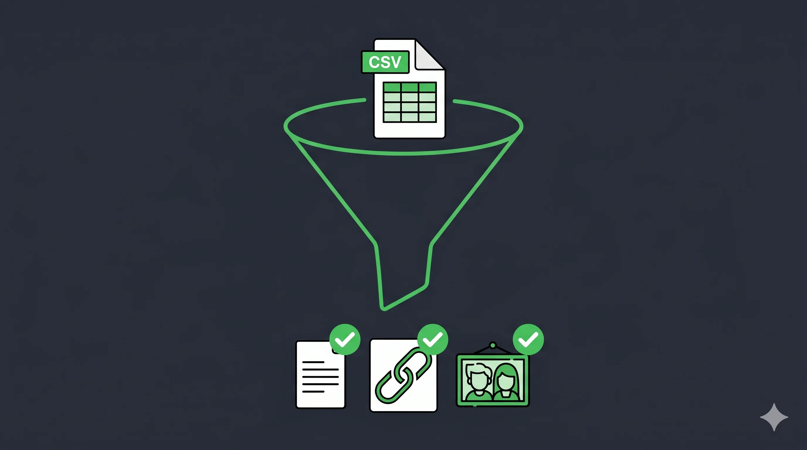

Tu n'as pas besoin d'IA pour gagner du temps.

La plupart des gains de productivité en entreprise viennent de l'automatisation. Pas de l'intelligence artificielle. Et c'est loin d'être la même chose.

## Ce que tout le monde confond

Chaque éditeur de logiciel, chaque agence digitale, chaque article de blog met IA partout. Résultat : les dirigeants confondent deux choses qui n'ont rien à voir.

**Une automatisation est déterministe.** Les mêmes données en entrée donnent toujours les mêmes résultats en sortie. Tu la programmes une fois, elle tourne toute seule, sans surprise.

**Une IA est un assistant qui réfléchit.** Tu lui donnes du contexte, des instructions, et il interprète. Ce qui veut dire qu'il peut varier, se tromper, nécessiter une relecture.

## Le cas du catalogue qui m'a tout fait comprendre

Un de mes clients gère un catalogue produits. Chaque référence : un article à créer, un lien à publier sur le site, une photo à associer. Tâche répétitive, mécanique, chiante.

On a d'abord essayé avec une IA. Ça marchait, la première fois, avec beaucoup de contexte et d'instructions. Mais à la mise à jour suivante, il fallait tout réexpliquer. Même instructions, résultats différents. Corrections, ajustements, nouvelle passe.

On a mis en place un automate. Il prend le fichier source, crée l'article avec le bon template, génère le lien, associe la photo. En quelques secondes. Résultat constant, garanti, zéro intervention humaine. L'équipe n'y pense plus.

**La règle :** si ta tâche est toujours la même (mêmes entrées, mêmes sorties), c'est un automate qu'il te faut. Pas une IA.

## Le coût que personne ne te dit

L'autre différence, c'est la maintenance.

Un automate, sauf bug, tourne tout seul. Tu le mets en place une fois et tu l'oublies. L'investissement est ponctuel.

Une IA, c'est du travail en continu. Les instructions évoluent, les résultats varient, le contexte change. Tu ajustes en permanence. C'est sa nature. Mais ça a un coût réel en temps, semaine après semaine.

Avant de choisir, pose-toi la question : est-ce que je suis prêt à maintenir ça sur la durée ? Pour une tâche mécanique, la réponse est non. L'automate est là pour ça.

Un de mes clients l'a dit clairement après qu'on ait cartographié ses process : *"Donc, en vrai, 99% de mes gains en productivité vont passer par des automates."*

Oui. C'est une bonne nouvelle, pas une déception.

## Comment savoir ce dont tu as besoin

Une seule question à te poser pour chaque tâche :

**Est-ce que le résultat doit être toujours identique, ou est-ce que ça dépend du contexte ?**

- Toujours identique → automatisation
- Ça dépend du jugement, de l'interprétation → IA

Et les deux se combinent bien. L'exemple classique : un automate récupère tes données et sort un tableau de bord. Une IA lit ce tableau et te suggère une décision. Tu valides. Chacun fait ce qu'il fait bien.

Ce qu'on oublie souvent : les plus gros gains ne viennent pas de la technologie la plus sophistiquée. Ils viennent de l'élimination des tâches bêtes que tes équipes font à la main depuis des années. [Bpifrance fait le point sur ce que l'automatisation change concrètement pour les PME en 2026.](https://bigmedia.bpifrance.fr/nos-dossiers/nouvelles-tendances-ia-ce-qui-va-transformer-2026) L'IA n'est pas nécessaire pour arriver à ce résultat.

Pour aller plus loin sur comment identifier ces tâches dans ton entreprise, [ce guide sur l'automatisation des tâches répétitives](/blog/automatiser-taches-repetitives-pme/) t'aidera à démarrer.

## La première action pour cette semaine

Prends la tâche qui te bouffe le plus de temps en ce moment.

Est-ce que le résultat doit être toujours pareil, ou est-ce que ça varie selon le contexte ?

Si tu veux aller plus vite, ouvre Claude ou ChatGPT et colle ce prompt :

> Analyse cette tâche que je fais régulièrement et dis-moi si j'ai besoin d'une automatisation, d'une IA, ou des deux : [décris ta tâche en 2-3 phrases].


Je t'aide à identifier ce qui peut être automatisé, ce qui bénéficierait d'une IA, et ce qui est juste mal organisé.


---

## FAQ

### C'est quoi la différence entre automatisation et IA ?

Une automatisation exécute des règles fixes : mêmes entrées, mêmes sorties, toujours. Une IA interprète et adapte selon le contexte. Les deux sont utiles, mais pas pour les mêmes tâches.

### Mon entreprise a-t-elle vraiment besoin d'IA ?

Probablement pas autant que tu le crois. La majorité des gains de productivité vient d'abord de l'automatisation des tâches répétitives. L'IA devient utile quand une tâche nécessite du jugement. Pas avant.

### Par où commencer pour automatiser dans mon entreprise ?

Identifie la tâche la plus chronophage et la plus répétitive. Si elle est mécanique (toujours la même séquence), c'est le meilleur candidat. Un [audit de process](/services/optimisation-process/) permet de cartographier ça rapidement et de prioriser ce qui a le plus d'impact.
