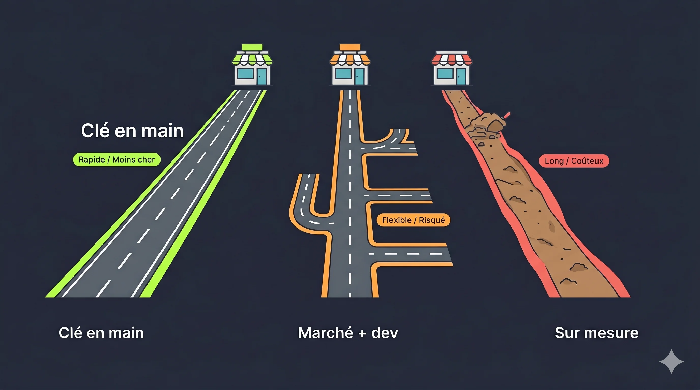
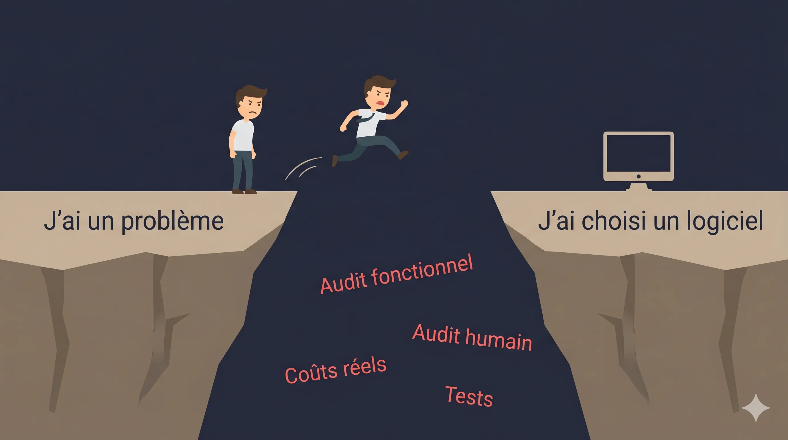

Pour choisir un logiciel de gestion PME, documente ton besoin avant de regarder des solutions : tes vraies douleurs, ton budget réel, tes process en détail. **La méthode compte plus que le produit.** La plupart des projets qui déraillent ne le font pas à cause d'un mauvais logiciel, mais à cause d'un mauvais cadrage.

Changer de logiciel de gestion, c'est pas une décision anodine. Ça va mobiliser tes équipes, immobiliser du budget, et changer ta façon de travailler pendant des mois.

La plupart des PME se plantent. Pas parce qu'elles choisissent le mauvais logiciel. Parce qu'elles ne savent pas cadrer le choix avant de commencer à regarder des solutions.

## Ce que j'observe sur le terrain

La scène se répète.

Un dirigeant entend parler d'un outil. Un concurrent l'utilise. Un associé en vante les mérites. Un commercial fait une belle démo. Il se dit que c'est exactement ce qu'il lui faut.

Résultat : il signe. Il lance le projet. Six mois plus tard, il réalise que le logiciel ne couvre pas 40% de ses process réels. Il demande des développements spécifiques à son prestataire. Soit c'est pas faisable. Soit ça coûte une fortune. Et à la prochaine mise à jour de l'éditeur, il faut tout redévelopper depuis zéro.

**Le problème n'est pas le logiciel. C'est la démarche.**

Un mauvais choix de logiciel, ça se repère après. Une mauvaise conception du choix, ça se règle avant. Et c'est là que tout se joue.

Quand je propose à un dirigeant de faire un cadrage sérieux avant de regarder le moindre outil, la réponse classique c'est : "C'est inutile, ça coûte cher, et je connais mes process internes."

Ce dirigeant-là va passer 18 mois sur un projet qui aurait dû en prendre 6.

## Clé en main, marché avec dev, ou sur mesure : comprends les 3 options

Avant toute chose, tu dois savoir quel type de projet tu veux lancer. Ce ne sont pas les mêmes budgets, les mêmes risques, ni les mêmes profils de prestataires.

**Option 1 : Outil clé en main.** Tu prends le logiciel tel qu'il est, et tu adaptes tes process à l'outil, pas l'inverse. C'est la solution la moins chère, la plus rapide à déployer, la plus simple à maintenir dans le temps. La limite : si ton activité est très spécifique, tu vas devoir faire des compromis sur certaines fonctionnalités.

**Option 2 : Outil du marché avec développements spécifiques.** Tu pars d'une base existante et tu lui ajoutes des fonctionnalités sur mesure. L'avantage : tu couvres tes besoins particuliers sans partir de zéro. Le risque : chaque mise à jour de l'éditeur peut casser ce que tu as fait développer. C'est l'option la plus mal maîtrisée, et de loin celle qui génère le plus de déceptions.

**Option 3 : Développement sur mesure total.** Tu pars de zéro. Coût élevé, délais longs, mais 100% adapté à ton fonctionnement. Réservé aux cas où aucune solution du marché ne couvre ton activité. C'est plus rare qu'on ne le croit.

La règle simple : **commence toujours par chercher une solution clé en main.** La complexité et les coûts supplémentaires ne se justifient que si le besoin est réellement impossible à couvrir autrement. Et ça, tu ne peux le savoir qu'après avoir fait le travail de cadrage qui suit.

## La méthode en 5 étapes

### Étape 1 : Pourquoi tu veux changer ?

C'est la question que personne ne prend le temps de se poser vraiment.

Pourquoi tu veux un logiciel de gestion ? Pourquoi maintenant ? Qu'est-ce qui ne marche plus avec ce que tu as aujourd'hui ? Qu'est-ce que tu espères avoir gagné dans 6 mois ?

Si ta réponse c'est "parce que tout le monde en a un" ou "parce que mon commercial m'a dit qu'il fallait migrer pour la facturation électronique" : c'est un signal d'alarme.

La réforme de la facturation électronique est une vraie contrainte réglementaire, [progressive pour les PME à partir de 2026](https://www.impots.gouv.fr/professionnels/la-facturation-electronique-entre-entreprises-assujettis-la-tva). Mais elle ne justifie pas à elle seule de changer tout ton système de gestion. Elle justifie de vérifier si ton logiciel actuel sera mis à jour pour être conforme. Ce que la plupart des éditeurs prévoient déjà.

Prends une feuille. Note tes vraies douleurs. Ce qui te coûte du temps. Ce qui génère des erreurs. Ce qui ralentit ton équipe. C'est ça, le point de départ. Pas la liste de fonctionnalités d'une brochure commerciale.

### Étape 2 : L'audit humain

Avant de parler fonctionnalités, tu dois faire le tour de ta situation réelle.

- **Budget** : combien tu peux réellement investir : licences + implémentation + formation + temps de tes équipes pendant le projet.
- **Délais** : quel est ton vrai délai, pas la deadline que tu t'es fixée pour te faire plaisir ?
- **Ressources internes** : qui va piloter le projet côté client ? Qui sont les utilisateurs clés ? Qui est pour le changement et qui est contre ? Qui seront les moteurs, qui seront les freins ?
- **Coûts cachés** : t'as anticipé la perte d'efficacité pendant le déploiement ? Les coûts de formation ? Le temps de tes équipes mobilisées sur le projet au lieu de leur travail habituel ? Les coûts d'opportunité ?

La question la plus dure : **combien ça te coûte vraiment de changer, versus de rester en l'état ?**

Beaucoup de dirigeants n'ont pas de réponse claire à cette question. Et ils lancent quand même le projet parce qu'un commercial leur a vendu du rêve.

### Étape 3 : L'audit fonctionnel

C'est l'étape que les commerciaux aimeraient que tu sautes.

Tu dois documenter, process par process, ce dont tu as besoin. Pas en surface. Dans le détail. Chaque cas particulier, chaque exception, chaque spécificité de ton activité. Les "oui mais chez nous c'est pas pareil pour les clients X" : c'est exactement ce qui doit être dans ce document.

Classe tes besoins en 3 catégories :

- **Obligatoire dès le lancement** : sans ça, le logiciel ne peut pas démarrer en production.
- **Bloquant à court terme** : pas obligatoire au jour 1, mais doit être là rapidement.
- **Optionnel** : nice-to-have pour les versions suivantes.

**Ce document, et seulement lui, te permet de comparer des logiciels de façon objective.** Pas une démo commerciale. Pas une brochure. Une démo de 45 minutes te montre ce que le logiciel sait faire de mieux. L'audit fonctionnel te révèle si ça couvre ce que toi tu as besoin de faire.

Si tu n'as pas fait cet audit, tu n'es pas en position de choisir.

### Étape 4 : Choisir l'outil et le prestataire

Là seulement, tu ouvres des comparatifs. Avec ta liste de critères en main.

Ce que tu regardes :

- **Couverture fonctionnelle** : est-ce que le logiciel couvre tes "obligatoires" sans développement spécifique ?
- **Ergonomie** : tes équipes vont l'utiliser tous les jours. Est-ce que c'est vraiment utilisable sans 3 jours de formation ?
- **Solidité de l'éditeur** : l'entreprise a combien d'années d'existence ? Combien de clients actifs ? Sera-t-elle encore là dans 5 ans ?
- **Coût réel** : licence + implémentation + formation + coûts cachés à 1 an, 3 ans, 5 ans. Pas juste le tarif mensuel affiché en grand sur la landing page.
- **Intégrations et personnalisation** : est-ce que ça parle avec tes autres outils sans développement spécifique ? Si tu as besoin de dev sur mesure, est-ce que ça reste maintenable à chaque mise à jour ?

Sur le prestataire : il vend le logiciel, il fait l'implémentation, il forme tes équipes. Ses témoignages sur son site ne valent rien. Demande des références : de vrais clients que tu peux appeler directement.

### Étape 5 : Décider et embarquer tout le monde

Un logiciel que tes équipes n'utilisent pas est un projet raté, même si l'outil est parfait techniquement.

Fais un vrai kickoff interne. Explique le pourquoi, pas juste le comment. Identifie les freins (les collaborateurs qui ont peur de changer, qui voient dans ce projet une menace) et travaille avec eux, pas contre eux. Écoute. Accompagne. Implique-les dans les décisions de paramétrage.

Et surtout, le truc que personne ne fait vraiment bien : **teste tout. Sans exception.**

Pas les cas nominaux. Pas les 3 scenarios principaux. Tous les process. Tous les cas particuliers. Toutes les exceptions identifiées dans ton audit fonctionnel. Avant la mise en production. Pas après.

Chaque bug découvert pendant la phase de test coûte 10 fois moins cher à corriger qu'un bug découvert en production, avec tes clients et tes fournisseurs qui subissent les conséquences.

## Les erreurs à éviter

**Choisir l'outil hype.** Ce n'est pas parce que tout le monde en parle que c'est fait pour toi. L'outil parfait pour une boîte de 200 personnes peut être un cauchemar à déployer dans une PME de 15. La taille et le secteur comptent.

**Sauter le cadrage.** "Je connais mes process, pas besoin de les documenter." C'est la phrase qui précède 90% des projets qui déraillent. Tu les connais dans les grandes lignes. Et surtout, ton prestataire, lui, ne les connaît pas du tout. [L'audit de process](/services/optimisation-process/), c'est justement ça : mettre à plat ce que tes équipes font réellement, pas ce que tu penses qu'elles font.

**Sous-estimer les coûts humains.** Le vrai coût d'un projet logiciel, c'est rarement la licence. C'est le temps de tes équipes mobilisées, la perte d'efficacité au démarrage, les formations, les allers-retours. Les projets qui dérapent le font presque toujours sur ces postes-là, pas sur le prix du logiciel. Si tu veux comprendre combien te coûtent vraiment tes process actuels, [cet article est un bon point de départ](/blog/automatiser-taches-repetitives-pme/).

**Trop personnaliser.** Dès que tu demandes du développement spécifique, tu prends un risque. Chaque mise à jour de l'éditeur peut casser ce que tu as fait développer, à tes frais. Résiste à la tentation de faire "coller" l'outil à ton fonctionnement actuel. Parfois, c'est ton fonctionnement qui doit évoluer. [C'est plus facile à accepter quand on a d'abord fait le travail de diagnostic](/blog/excel-nest-pas-un-outil-de-gestion/).

**Ne pas tester sérieusement.** La recette de projet (le test final avant mise en production) est traitée comme une formalité dans beaucoup d'entreprises. C'est une erreur. C'est ta dernière ligne de défense avant que tes clients, tes fournisseurs et tes équipes subissent les problèmes à ta place.

---

**Choisir un logiciel de gestion, c'est un projet. Pas une décision qu'on prend après une démo de 45 minutes.**

Le bon logiciel existe. Tu vas le trouver.

Mais pas en regardant des comparatifs avant d'avoir fait le travail. Cadre d'abord. Choisis ensuite.

Si tu veux être accompagné dans cette démarche sans qu'on essaie de te vendre un produit, c'est exactement ce que je fais. [On en parle ?](/services/accompagnement-projet-informatique/)


