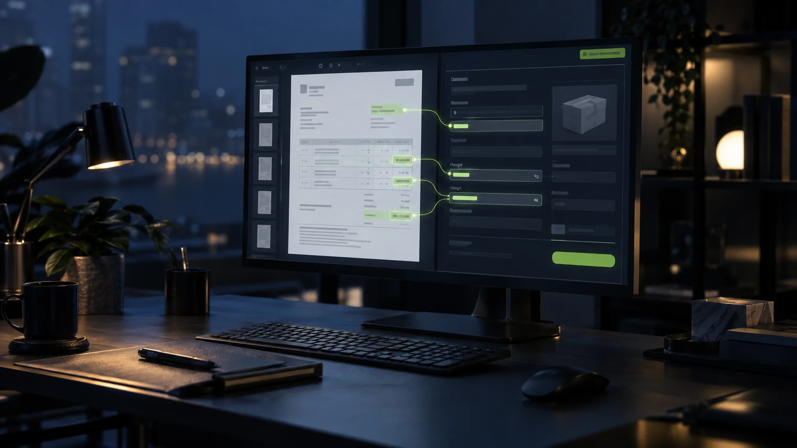

La saisie des articles depuis une facture fournisseur devient automatique quand un programme lit le PDF, reconnaît chaque champ (référence, libellé, poids, prix) et pré-remplit la fiche article et le bon d'achat dans ton logiciel de gestion. Ton acheteuse valide avant que rien ne parte dedans, elle ne retape plus rien.

Le prix de vente d'un article passe par 5 mains avant d'être saisi. Une des cinq, c'est une imprimante.

## Un conteneur, une demi-journée de saisie

Une facture fournisseur arrive en PDF. Le logiciel de gestion attend les mêmes informations : référence, libellé, poids, prix. Entre les deux, quelqu'un tape.

Dans un magasin de meubles avec deux points de vente, sur AS400, l'acheteuse créait chaque article à la main depuis la facture : le poids, l'éco-mobilier, le libellé, puis elle montait le bon d'achat avec un calcul de remise sur Excel à côté. Un conteneur, c'était une demi-journée de saisie, 2,5 jours par semaine au total. Deux conteneurs traités par jour au mieux, alors que le patron en voulait quatre. Le problème n'était pas l'acheteuse. C'était le nombre de fois où la même information passait d'un écran à un autre, à la main.

## Étape 1 : le programme lit la facture, pas ton acheteuse

La première brique, c'est la lecture du PDF. Un système (ici l'intelligence artificielle sert vraiment, la seule fois où le mot compte dans cet article) reconnaît quel bloc de texte correspond à la référence, au libellé, au poids, au prix d'achat, quelle que soit la mise en page du fournisseur. Il n'y a pas deux factures fournisseurs mises en page pareil, et c'est exactement ce que la lecture automatique encaisse.

Dans le magasin de meubles cité plus haut, ce mécanisme lit la facture, pré-remplit les champs, et propose l'injection directe dans l'AS400. Il est en prod depuis juillet 2026, testé par l'acheteuse elle-même.

Un [comparatif des outils de lecture de facture](https://www.docaposte.com/blog/article/ocr-facture) évoque une précision de plus de 99 % sur des documents de bonne qualité. Ce que ces guides ne disent pas : cette précision sert d'abord la compta, extraire un montant, une TVA, une date. Pas la création d'une fiche article complète avec poids, éco-participation et circuit de prix de vente. C'est là que la plupart des outils du marché s'arrêtent, et que le travail continue à la main.

## Étape 2 : il propose, ton acheteuse valide

Rien ne s'injecte tout seul dans le logiciel. Le système propose une fiche article et un bon d'achat pré-remplis. Ton acheteuse regarde, corrige si besoin, valide. C'est elle qui décide, pas le programme.

**Un système qui lit une facture ne remplace pas ton acheteuse. Il lui rend ses journées.**

C'est cette étape qui change tout par rapport à une automatisation aveugle : si le fournisseur a fait une erreur de référence ou de poids sur sa facture, c'est l'acheteuse qui l'attrape, pas le logiciel.

## Étape 3 : le prix de vente sort sans repasser par l'imprimante

Dans le même magasin, le prix de vente d'un article passait par 5 étapes avant d'être fixé : l'acheteuse exportait les données, le comptable renseignait sa part, l'acheteuse imprimait la liste pour le patron, le patron corrigeait au stylo sur le papier, l'acheteuse ressaisissait chaque article corrigé dans le logiciel. Cinq mains. Une imprimante.

**Cinq mains pour fixer un prix, dont une imprimante, ce n'est pas un contrôle. C'est un circuit qui s'est complexifié sans que personne ne le décide.**

Une fois la création d'article automatisée, ce circuit peut entrer dans le même système : le prix proposé, la marge visible, la validation du patron en ligne, sans papier entre les deux. C'est le chantier suivant, dans le même magasin.

## L'erreur qui garde la ressaisie triple

Automatiser une seule étape ne suffit pas si le reste du circuit garde ses ressaisies. Chez un importateur de meubles et de tapis, 120 conteneurs par an, sur Sage 100, chaque achat demande encore de créer un fichier « carton » à imprimer pour le fournisseur, avec un code EAN calculé dans un Excel séparé puis copié-collé, de ressaisir les mêmes informations dans Sage, puis de recréer le bon de livraison depuis la proforma. Trois saisies de la même donnée, avant même de parler de prix de vente.

**Trois saisies de la même information, ce n'est pas de la rigueur. C'est de la friction qu'on a fini par trouver normale.**

Une dirigeante d'épicerie fine qui importe listait spontanément la création d'articles parmi les tâches à supprimer de son quotidien, avec la gestion des promos. Sa tâche la plus chronophage, disait-elle : « tout, et surtout les mails ». Ce n'est pas un caprice. C'est une tâche qui n'apporte plus rien une fois qu'elle a été bien faite une fois.

Ce chantier ressemble à n'importe quelle [automatisation d'une tâche répétitive](/blog/automatiser-taches-repetitives-pme/) dans une PME. Ce qui change, c'est le point de départ : un PDF que personne ne peut modifier, et un logiciel qui n'accepte que des champs propres. Si tu veux savoir si l'intelligence artificielle a sa place dans ton cas ou si un automate classique suffit, [cet article compare les deux](/blog/automatisation-vs-ia-pme/).

Un [audit de poste ciblé](/services/optimisation-process/) commence exactement comme les exemples ci-dessus : on regarde combien de fois la même information est retapée avant de proposer quoi que ce soit.


Cinq questions sur tes commandes fournisseurs, ta caisse ou ta compta, et je te dis ce qui est automatisable chez toi.

