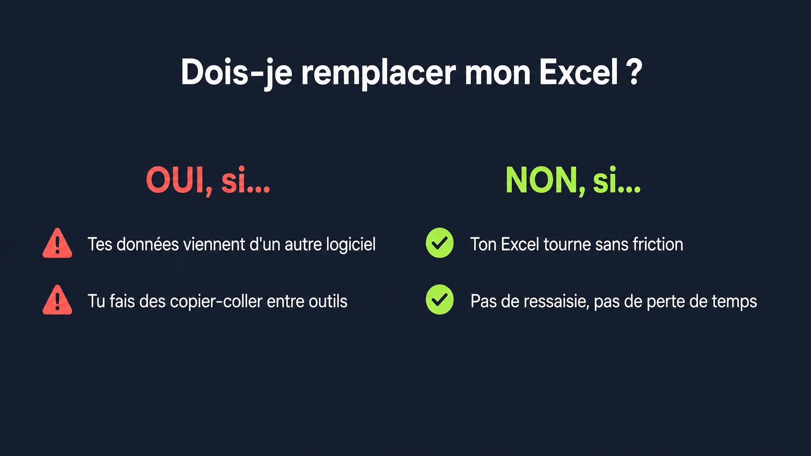

**La mauvaise question, c'est 'Excel ou logiciel métier ?'. La bonne, c'est 'est-ce qu'Excel fonctionne vraiment chez toi ?'**

Si tu perds du temps à cause d'Excel, le problème n'est pas Excel. C'est l'usage que tu en fais.

## Ce que presque tout le monde fait de travers

Les articles sur le sujet te donnent des listes. "7 signes qu'il est temps de remplacer Excel." "Les 5 limites d'Excel pour les PME." Et à la fin, ils te vendent leur logiciel.

Ce n'est pas une liste de signes qu'il te faut. C'est deux questions concrètes.

## Signal 1 : tes données existent déjà ailleurs

J'ai accompagné une PME dont l'équipe passait chaque semaine à extraire des données de plusieurs logiciels, à les coller dans différents Excel, puis à consolider tout ça dans un tableau croisé dynamique pour avoir un dashboard lisible.

**Une heure de travail manuel. Chaque semaine. Pour afficher des données qui existaient déjà dans leurs outils.**

Le problème n'était pas Excel. C'était qu'Excel servait de pont entre des systèmes qui ne se parlaient pas. On a remplacé ce pont par un développement spécifique. Résultat : le même dashboard, mis à jour en une seconde, sans manipulation.

**Si les données que tu colles dans Excel viennent d'un autre logiciel ou d'une base de données existante, tu fais du travail inutile.** Excel n'est pas là pour stocker des informations — il est là pour les analyser. Quand il fait les deux, c'est un symptôme.

## Signal 2 : tu fais des copier-coller entre outils

Tu exporter depuis un logiciel. Tu ouvres Excel. Tu fais un export depuis un deuxième logiciel. Tu rappatries. Tu consolides. Tu recommences le mois prochain.

**Chaque copier-coller, c'est du temps perdu et un risque d'erreur.** Une case mal collée. Une ligne décalée. Un oubli de mise à jour. Ce n'est pas visible dans les chiffres de productivité, mais ça ronge le temps de tes équipes au quotidien.

C'est exactement le scénario où Excel devient le problème. Pas parce qu'il est nul — mais parce qu'il bouche un trou là où il faudrait une connexion propre entre les systèmes.

Si tu te reconnais là-dedans, l'article sur [l'automatisation des tâches répétitives](/blog/automatiser-taches-repetitives-pme/) explique comment identifier et traiter ce type de friction.

## Quand Excel doit rester

Un de mes clients utilise un fichier Excel pour gérer les congés, les absences et les heures supplémentaires. Il est mis à jour au fil de l'eau tout le mois par les managers. À la fin du mois, il est au bon format pour être injecté directement dans l'outil de paie.

Zéro ressaisie. Zéro copier-coller. Zéro perte de temps.

**Est-ce qu'on remplace ce fichier par un logiciel ? Non.**

Pas parce qu'on est attaché à Excel. Parce que le process fonctionne. Les habitudes sont en place. Le format correspond à ce qu'attend l'outil en bout de chaîne. Changer pour "faire joli et moderne" n'apporterait rien. Et ça coûterait de la formation, de l'adaptation, et du risque d'erreur le temps que tout le monde s'y habitue.

**Un logiciel métier n'est pas une upgrade automatique. C'est une réponse à un problème réel.**

## Le seul critère qui compte

Pas l'esthétique. Pas la modernité. Pas ce que fait la concurrence.

**Le seul critère : est-ce que tu gagnes du temps ou tu en perds ?**

Si ton Excel te fait perdre une heure par semaine à cause de consolidations manuelles, le calcul est simple. Si ton Excel tourne bien et que personne ne se plaint, ne change rien.

La plupart des décisions de remplacement que j'observe se font pour de mauvaises raisons — pression d'un éditeur, image de modernité, ou parce que "tout le monde est passé au cloud". Ce ne sont pas des critères. Ce sont des justifications.

Avant de toucher à quoi que ce soit, [fais d'abord le diagnostic de tes process](/services/optimisation-process/). Tu sauras exactement où tu perds du temps, et si Excel en est la cause ou pas. Et si tu te poses la question pour un projet de migration plus large, [cet article sur le choix de logiciel](/blog/choisir-logiciel-gestion-pme/) t'évite les pièges classiques.

---

Tu ne sais pas si ton usage d'Excel est un problème ou non ? [Contacte-moi](/contact/) — une heure suffit pour avoir une réponse claire.


