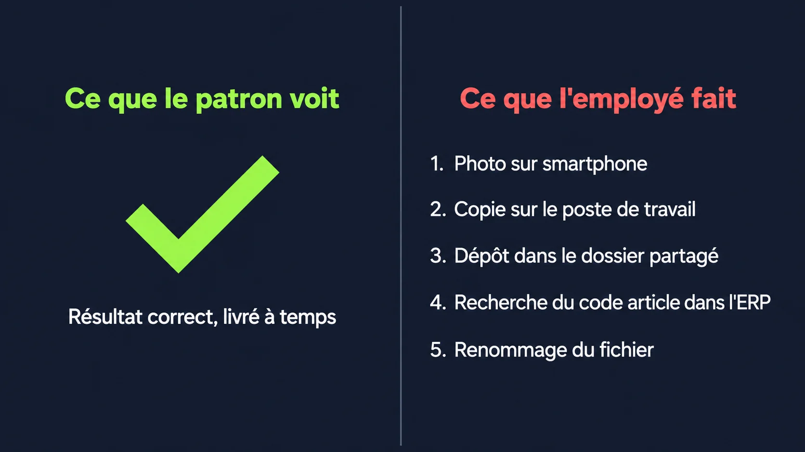

Les process cassés dans une PME se voient rarement depuis le bureau du patron. C'est l'assistante, le commercial, la responsable achat qui absorbent la douleur. En silence, depuis des mois, parfois des années.

## "Ça tourne" : le mensonge le plus cher de la gestion

Tu ne reçois pas de plainte. Les factures partent, les commandes arrivent, les devis sont envoyés. Tu en conclus que ça fonctionne.

Et tu as raison. Ça fonctionne. Sauf que le coût de ce fonctionnement, tu ne le vois pas.

**Le fait que ça tourne ne veut pas dire que ça tourne bien.**

Ce que tu vois, c'est l'output. Ce que tu ne vois pas, c'est l'énergie que tes équipes dépensent pour produire cet output. Chaque jour, en silence, elles comblent les trous du process avec leur temps.

## Pourquoi tu ne le vois pas

Le problème ne remonte jamais. Pas parce que tes équipes se taisent par peur. Mais parce que "c'est comme ça qu'on a toujours fait". Le workaround est devenu la norme. Personne ne pense à s'en plaindre parce que personne n'imagine qu'il pourrait en être autrement.

Les [tâches répétitives mobilisent jusqu'à 30% du temps de travail des équipes](https://clustdoc.com/blog/fr/ce-que-coutent-vraiment-les-taches-repetitives-a-votre-pme-clust-blog/). Dans les PME, ce chiffre est invisible parce que le résultat final, lui, est correct.

**Le symptôme visible, c'est toujours le résultat. Le coût caché, c'est le chemin pour y arriver.**

Et ce chemin, personne ne le regarde tant que la destination est atteinte.

## Ce que je vois chez mes clients

Je ne découvre jamais ces problèmes parce qu'un employé vient me les signaler. Je les découvre en posant des questions simples. "Montre-moi comment tu fais ça."

**Une assistante administrative resaisit des factures fournisseurs à la main depuis des années. Entre 4 et 8 heures par semaine.** Le patron ne le sait pas. La tâche pourrait être faite en 1 heure avec le bon outil. Personne n'avait posé la question.

Une responsable achat copie-colle ses articles entre un tableau Excel et son logiciel de gestion pour chaque nouvelle référence. Elle le fait depuis que l'entreprise a implanté le logiciel. Elle n'a jamais dit que c'était pénible. C'est juste "sa partie du travail".

Un responsable commercial fait ses devis dans son logiciel, puis recopie tout dans Excel pour respecter les formats demandés par ses clients. Deux fois le même travail. À chaque devis.

Dans une PME grossiste, une équipe photographie chaque article avec un smartphone, copie la photo sur le poste de travail, la dépose dans un dossier partagé, cherche le code article dans l'ERP, renomme le fichier avec ce code. Pour chaque article. Des centaines de fois.

Ce ne sont pas des cas rares. C'est ce que je trouve à chaque audit.

## Ce que tu peux faire cette semaine

Tu n'as pas besoin d'un audit complet pour commencer. Tu as besoin d'une seule question.

Va voir chacun de tes collaborateurs. Demande-leur : **"C'est quoi la tâche que tu détestes le plus faire ?"**

Écoute. Ne défends pas les outils que tu as choisis. Note juste ce qu'ils te disent.

La réaction que je vois le plus souvent chez les patrons quand on remonte ensemble ces tâches : **"Je savais pas qu'on pouvait automatiser tout ça ! Je veux !"**

Ce n'est pas de la mauvaise volonté. C'est juste que personne n'avait regardé. Et personne ne regarde tant que ça tourne.

Ton process ne te fait pas mal. Mais quelqu'un dans ton équipe passe des heures sur une tâche qui pourrait prendre quelques minutes. Il n'osera pas te le dire si tu ne lui poses pas la question.

---

C'est exactement ce que je fais lors d'un [audit de process](/services/optimisation-process/) : poser les bonnes questions, et rendre visible ce qui était invisible. Si tu veux qu'on regarde ça ensemble, [contacte-moi](/contact/).

Pour comprendre comment remonter à la cause racine d'un workflow lent, j'ai détaillé la méthode ici : [Ton employé n'est pas trop lent. Ton workflow l'est.](/blog/ton-employe-pas-trop-lent-workflow/)


